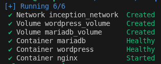
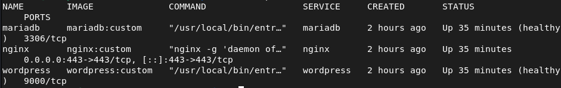

*This project has been created as part of the 42 curriculum by tclouet.*

# User documentation

*This file explains, in clear and simple terms, how an end user can understand what services are provided by the infrastructure and how it works.*

### **1. What services are provided by the stack:**

*As described in the `README.md` file, the infrastructure represents a LEMP stack (Linux, NGINX, MariaDB, PHP-FPM/WordPress).*

#### NGINX:

	Serves the website content to users.

#### PHP-FPM/WordPress: 

	Runs the WordPress application. It generates the website pages and features you see, such as posts, pages and user content.

#### MariaDB: 

	Stores all the website data, including user accounts and settings. WordPress reads from and writes to this database to manage the site.

### **2. Start and stop the project:**

*To see all available commands, use `make help`.*

- After filling in the secrets and environment variables with your own values (see the `README.md` file), open a terminal in the project's root directory.

- Before starting the project, run `make build`. This command will:

	- set up all services

	- create persistent data volumes

	- configure the virtual network

- Once the build is complete, run `make up` to start all services. You should see the following output in your terminal:

	

- To stop the infrastructure, the following commands are available:

	- `make stop` stops the running containers.
	
	- `make down` stops and removes the containers and the network.

	- `make destroy` removes the entire infrastructure, including persistent data. Use this command with caution; you will be prompted for your sudo password.

### **3. Access the website and the administration panel:**

Once the project is running, you can access the website via:

	https://DOMAIN_NAME.42.fr/

You can access the WordPress administration panel at:

	https://DOMAIN_NAME.42.fr/wp-admin/

*You will be prompted to enter the WordPress administrator or editor/author username along with the corresponding password to log in.*

### **4. Locate and manage credentials:**

Your credentials are stored in `.txt` files located in the `secrets` directory and in environment variables defined in the `.env` file.

If you need to change these credentials, you must first shut down the infrastructure and remove all persistent data using the `make destroy` command.

### **5. Check that the services are running correctly:**

When the infrastructure is running, the `make ps` command displays all running containers and their current status.

Below is an example of the expected result:

